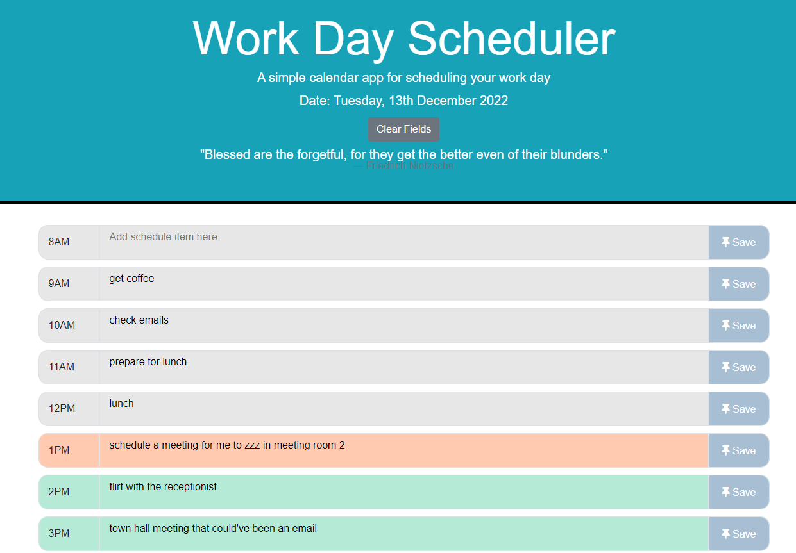

# work-day-scheduler-shannon

## Description

As a review of the materials we learnt in our seventh week, our **Week 7 Challenge** will test our skills in HTML, CSS, JavaScript and Third-Party API - jQuery by having us create a workday scheduler.

In this web application, I have applied the following skills:

>00. jQuery
>01. JavaScript
>02. Google-fu
>03. Google-fu
>04. Google-fu
>05. Lots of tears
>06. Google-fu
>07. Googling Youtube

## Installation

N/A

## Usage 

Enter an event when you click on a timeblock, and save the event in kicak stirage with the "Save" button with the thumbtack icon.

Bonus... you can clear the saved events by clicking the grey "Clear Fields" button.

Workday Scheduler Website:
https://damnsemicolon.github.io/work-day-scheduler-shannon

Screenshot of deployed website:

## Credits

Philip Howley (Instructor) 
Nic Catania (TA) 
Pod-4 mates 
Myself

## License

## Badges

